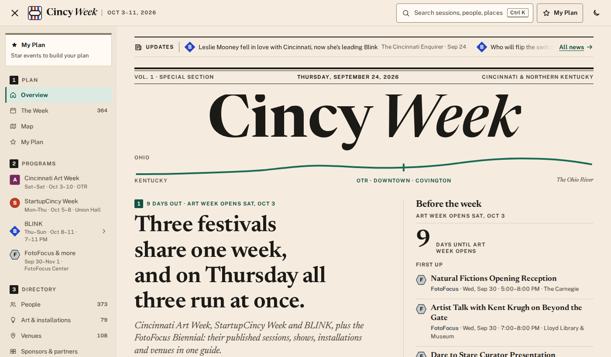
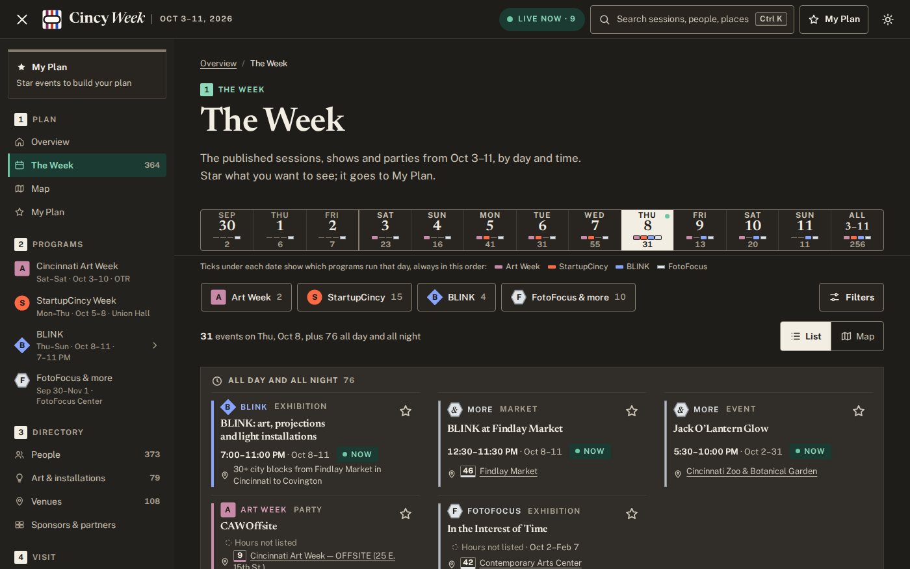
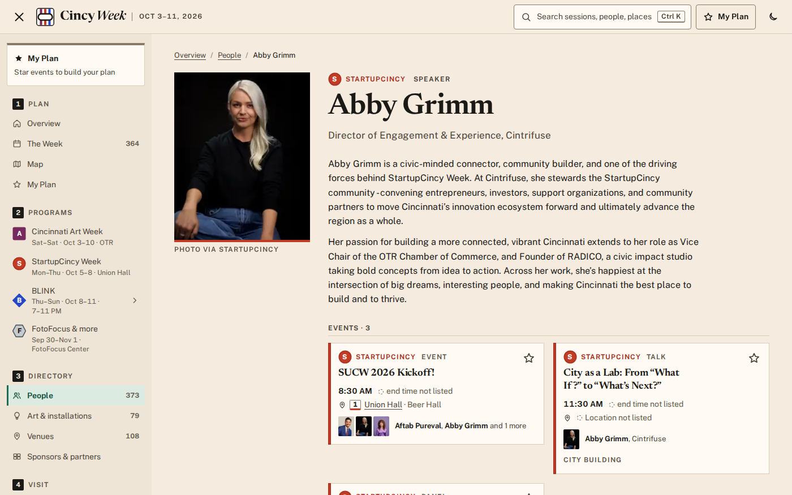
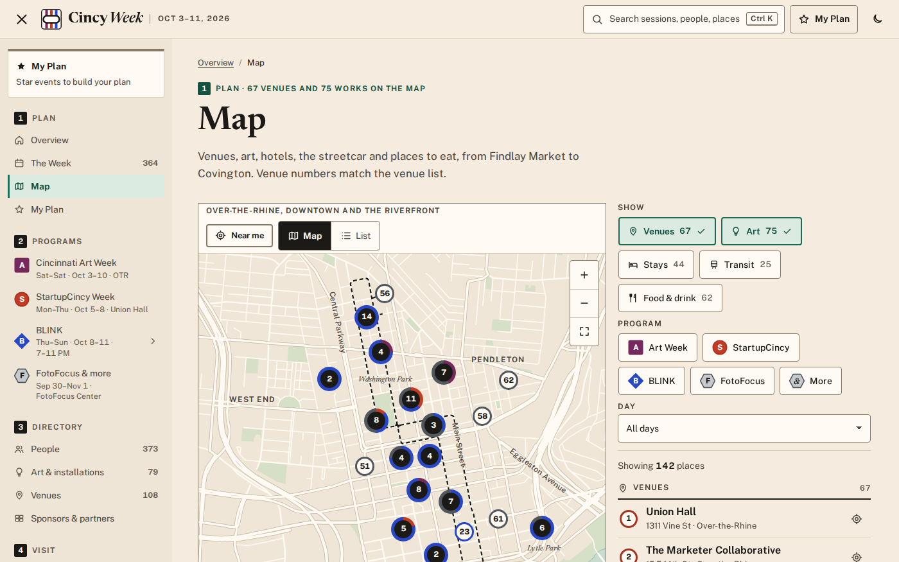
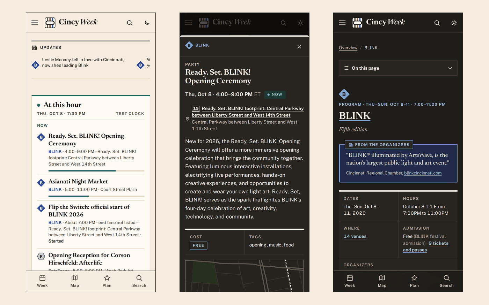

<div align="center">

# Cincy Week

**Cincinnati's first week of October 2026 in one guide: Art Week, StartupCincy Week, BLINK and the FotoFocus Biennial, every entry linked to its source.**

An independent visitor's guide to Cincinnati Art Week (Oct 3–10), StartupCincy Week (Oct 5–8), BLINK (Oct 8–11), the FotoFocus Biennial (Sep 30–Nov 1) and other happenings that week. It covers 364 events, 373 people, 79 artworks and 108 venues, plus where to stay and how to get around. During the week it shows what is on now.

[**Live site**](https://fritzhand.github.io/cincy-week/) · [**The Week**](https://fritzhand.github.io/cincy-week/schedule.html) · [**Thursday, Oct 8**](https://fritzhand.github.io/cincy-week/schedule.html?day=2026-10-08) · [**Map**](https://fritzhand.github.io/cincy-week/map.html) · [**BLINK art**](https://fritzhand.github.io/cincy-week/art.html?p=blink) · [**People**](https://fritzhand.github.io/cincy-week/people.html) · [**Where to stay**](https://fritzhand.github.io/cincy-week/stay.html)


-7ebc6f?style=flat-square&logo=openstreetmap&logoColor=white)


<br>

<a href="https://fritzhand.github.io/cincy-week/"></a>

*The home page nine days out. The design is called "Interchange": a newspaper special section drawn like a transit map. Each program is a line, each day is a station, and Thursday, Oct 8 is the interchange.*

</div>

## What it looks like

These views are from the [live site](https://fritzhand.github.io/cincy-week/). The first shows The Week on Thursday, Oct 8 at 7:30 PM in the dark edition. The test clock (`?now=2026-10-08T19:30`) shows what a visitor will see that evening. The others show a speaker's page, the map, and three phone screens.

| | |
| --- | --- |
|  |  |
|  |  |

## What's on the site

| Page | What it does |
| --- | --- |
| [Overview](https://fritzhand.github.io/cincy-week/) | The week as a front page: the lead story, a countdown before the week, and "At this hour" during it (now, open now, next, tonight). Also a news ticker and one line per program. |
| [The Week](https://fritzhand.github.io/cincy-week/schedule.html) | All 364 events by day and time, with live status ("Now", "In 20 min", "Ended"). Filter by program, kind, time of day, neighborhood, venue, free, or your stars, as a list or on a map. Every filter is in the URL, e.g. [`?day=2026-10-08&p=blink`](https://fritzhand.github.io/cincy-week/schedule.html?day=2026-10-08&p=blink). |
| [Map](https://fritzhand.github.io/cincy-week/map.html) | A custom OpenStreetMap basemap in the site's light and dark editions: 67 numbered venues, 75 artworks, hotels, Connector streetcar stops and places to eat. It works without a map service. |
| [My Plan](https://fritzhand.github.io/cincy-week/plan.html) | Star events and artworks. It flags clashes and walking gaps, exports a calendar (.ics) and shares a plan as a link. The plan stays in your browser: no account, nothing sent. |
| [Art Week](https://fritzhand.github.io/cincy-week/art-week.html) · [StartupCincy Week](https://fritzhand.github.io/cincy-week/startupcincy-week.html) · [BLINK](https://fritzhand.github.io/cincy-week/blink.html) · [FotoFocus & more](https://fritzhand.github.io/cincy-week/fotofocus.html) | One page per program: dates and hours, tickets and passes, day by day, people, works, venues, sponsors, FAQ, news and sources. |
| [People](https://fritzhand.github.io/cincy-week/people.html) | 373 speakers, artists, curators and organizers, each with their own page: headshot (when published), verbatim bio, sessions and works. |
| [Art & installations](https://fritzhand.github.io/cincy-week/art.html) | 79 works (75 at BLINK, 4 at Art Week) as a grid or on the map, filterable by program, medium, zone and neighborhood. |
| [Venues](https://fritzhand.github.io/cincy-week/venues.html) | 108 venues, each with its own page: address, mini-map, walking directions, and what's on there by day. |
| [Sponsors & partners](https://fritzhand.github.io/cincy-week/partners.html) | 155 organizations by program and tier, with their logos. |
| [Where to stay](https://fritzhand.github.io/cincy-week/stay.html) · [Getting around](https://fritzhand.github.io/cincy-week/getting-around.html) · [Neighborhoods](https://fritzhand.github.io/cincy-week/neighborhoods.html) · [Eat & drink](https://fritzhand.github.io/cincy-week/eat-drink.html) | 140 places to stay, including StartupCincy Week's two room blocks as published and the hotels on BLINK's booking portal. Transit, parking, bike and accessibility notes, 22 neighborhoods, 64 places to eat and drink. |
| [FAQ](https://fritzhand.github.io/cincy-week/faq.html) · [News](https://fritzhand.github.io/cincy-week/news.html) · [About & sources](https://fritzhand.github.io/cincy-week/about.html) | 103 organizers' answers, quoted verbatim. 212 news items, refreshed automatically. How the guide is made, with every source listed. |

Search everything with <kbd>⌘</kbd> <kbd>K</kbd>, <kbd>Ctrl</kbd> <kbd>K</kbd> or <kbd>/</kbd>. Every list of events, people, works and places is in the page itself, so the guide still reads without JavaScript.

## What's in the data

Counted from `data/` on September 24, 2026 (the build prints the same totals):

| | Art Week | StartupCincy Week | BLINK | FotoFocus | More happenings | Total |
|---|---:|---:|---:|---:|---:|---:|
| Events | 31 | 120 | 25 | 121 | 67 | **364** |
| People | 16 | 152 | 105 | 73 | 29 | **373** |
| Works | 4 | 0 | 75 | 0 | 0 | **79** |
| Venues | 7 | 7 | 14 | 67 | 21 | **108** |
| Organizations | 15 | 45 | 73 | 9 | 25 | **155** |
| FAQs | 12 | 31 | 42 | 18 | 0 | **103** |

People, venues and organizations can belong to more than one program, so a row can add up to more than its total. The guide also has 140 places to stay, 248 places (neighborhoods, transit, parking, food, drink, landmarks, accessibility), 212 news items, 213 sourced facts and 642 credited names without a person page. There are 405 images: 242 headshots, 120 logos and 43 artwork photos, all downloaded, none hotlinked. The site has **501 pages**.

## How it works

```
research slices (8)          scw-agenda · scw-info · blink-art · blink-info · caw · also · news · stay-move
  the organizers' pages,       one JSON file per record type, every record with its source_url,
  captured Sep 2026            a REPORT.md per slice
      │
      │  verification: counts re-derived from the sources, records spot-checked live,
      │  then a data-accuracy audit (every StartupCincy session time, all 242 headshots, 120 logos)
      ▼
scripts/merge-research.mjs   one deterministic merge; every judgment call is a named table,
      │                        logged in data/README.md; geocoding via OpenStreetMap Nominatim (cached)
      ▼
data/*.json                  the single source of truth: 364 events · 373 people · 79 works ·
      │                        108 venues · 155 orgs · 140 stays · 248 places · 212 news
      +
site/                        tokens.css (every color and font) · CSS partials · client JS · fonts · images
      │
      │  node build.mjs          validate every field → render → crawl every link → atomic swap
      ▼
docs/  →  GitHub Pages       501 static pages, a search index, a sitemap, JSON for the dialogs
```

1. **Research.** Each slice was captured from the organizers' own pages and checked in a separate verification pass.
2. **Merge.** `scripts/merge-research.mjs` turns the slices into `data/*.json`. Descriptions and bios stay verbatim. Unknowns stay `null` and are printed as unknowns ("end time not listed", "Room not listed"), never guessed.
3. **Build.** `node build.mjs` validates the data field by field. It checks for missing sources, `http:` links, HTML in text, dates outside the week, dangling references and color literals outside the tokens. It renders every page, then crawls the output for broken links, anchors, query values, missing alt text and more. It stops and lists every problem, and `docs/` is only replaced when all of them are fixed.
4. **Publish.** `docs/` is committed on `main`, and GitHub Pages serves it.

## Publish

Pick one in **Settings → Pages**:

- **Deploy from a branch → `main` → `/docs` → Save.** This works because `docs/` is committed.
- Or use the included workflow: `.github/workflows/deploy-pages.yml` copies `docs/` to a `gh-pages` branch on every push that changes it. Then choose **Deploy from a branch → `gh-pages` → `/ (root)`**.

Either way the site lives at `https://fritzhand.github.io/cincy-week/`. `refresh-news.yml` fetches vetted headlines on a schedule (daily in September, every 6 hours Oct 1–12), rebuilds, and publishes itself. `test.yml` runs the build and the tests on every push, and fails if `docs/` was not rebuilt.

## Run and maintain it

Node 18 or newer. There is nothing to install: the build has zero dependencies.

```sh
npm run dev                     # build docs/ and serve it at http://localhost:8000/cincy-week/
node build.mjs                  # build only (stops and lists every problem; docs/ is untouched on failure)
npm test                        # 164 tests: unit, fixture builds, broken-data mutations, data checks
python3 scripts/fetch-cincy-news.py      # refresh data/news.json by hand (the workflow does it on a schedule)
python3 scripts/fetch-images.py          # download new headshots, logos and artwork photos into site/img/
NODE_PATH=<global node_modules> node scripts/shots.mjs --states   # screenshots + audit (needs Playwright)
```

To preview the week before it starts, add `?now=2026-10-08T19:30` (New York time) to any local URL. `?theme=light|dark` forces an edition.

**Fixing something?** Edit the record in `data/*.json` and keep its `source_url`. Run `node build.mjs`, fix whatever it names, and commit `data/` and `docs/` together. [CLAUDE.md](CLAUDE.md) is the maintenance manual. It covers correcting an event, adding a person or sponsor, cancellations, news, images and every validation. [build/CONTRACTS.md](build/CONTRACTS.md) has the exact APIs.

## Honest limitations

- **This is an independent guide.** No organizer produces, endorses or pays for it, and it sells no tickets. Always check the official sites before you go. Every page links to its sources.
- **Programs change.** The research was captured in September 2026. After that, only the news refreshes by itself. Everything else changes only when someone edits `data/`.
- **Art Week's program was only partly announced.** Its schedule comes from a draft schedule page the organizers had published but not linked. Storefront gallery addresses, the map and most participating artists had not been announced at the last update, and the Art Week page says so.
- **"More happenings" is a selection, not a complete calendar** of Oct 3–11.
- **Some details are missing at the source.** Missing end times, rooms and addresses are shown as not listed. 67 of the 108 venues are on the basemap. 38 lie outside it (FotoFocus reaches Dayton and Columbus), and 3 have no published location. Walking times are estimates, and the site labels them that way.
- **Images belong to their owners.** Headshots, logos and artwork photos were downloaded from the programs' public pages and are credited on the site ("Photo via BLINK"). If something is yours and you want it corrected or removed, [open an issue](https://github.com/fritzhand/cincy-week/issues) and it will be taken down.

## Credits

- **The organizers**, whose published programs this guide indexes: Cincinnati Art Week (Cincy Nice, No Standing), StartupCincy Week (StartupCincy, Cintrifuse), BLINK (Cincinnati Regional Chamber, AGAR, the Haile Foundation, ArtsWave) and FotoFocus. Descriptions, bios and FAQ answers are theirs, quoted verbatim with a link to the source.
- **Map data** © [OpenStreetMap contributors](https://www.openstreetmap.org/copyright), available under the Open Database License (ODbL). Addresses were geocoded with OpenStreetMap Nominatim.
- **Type:** Newsreader and Public Sans, self-hosted under the SIL Open Font License 1.1 (license texts in `site/fonts/`).
- **The engine** grew out of [fritzhand/startup-india-guide](https://github.com/fritzhand/startup-india-guide) (the sidebar, search and docs shell) and [fritzhand/quickstart](https://github.com/fritzhand/quickstart) (fail-before-write builds, the link crawler, focus traps).

Built and maintained by [Jeremy Fritzhand](https://github.com/fritzhand).

## License

The code is MIT; see [LICENSE](LICENSE). Content quoted from the organizers, and the images downloaded from their pages, remain theirs. Map data is ODbL, and the fonts are OFL.
